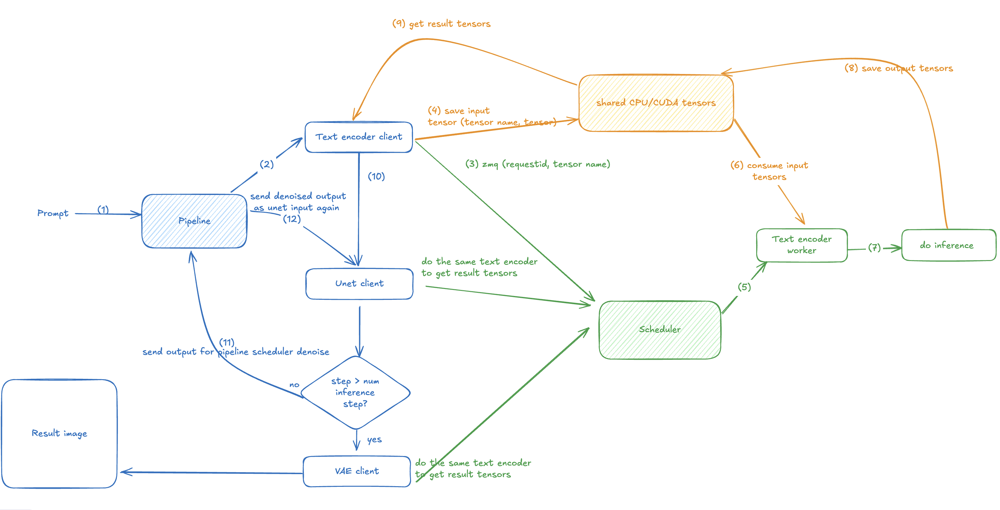

# Install VDiffuser for Develop

## Initial Idea



VDiffuser was created to solve performance bottlenecks in diffusion model pipelines:

### The Problem
Each diffusion pipeline typically consists of 4 main components:
- **Text Encoder** - processes input prompts
- **Diffusion Model** (UNet or Transformer) - generates the core image
- **VAE** (Variational Autoencoder) - encodes/decodes between pixel and latent space  
- **Pipeline Scheduler** - manages the denoising process

Even when running asynchronously in a single process, pipelines with large models can easily get blocked by other threads, leading to performance bottlenecks.

### Our Solution
- **Keep Diffusers Framework**: Don't reinvent the wheel. Diffusers is a large, well-established library with extensive model support, so we build on top of it rather than replacing it.

- **Multi-Process GPU Workers**: Run all GPU worker models in separate processes to avoid being blocked by Python's GIL (Global Interpreter Lock) threads from the main pipeline. This enables truly asynchronous pipeline execution.

- **Easy Batching**: The architecture naturally supports batching multiple requests for improved throughput and GPU utilization.

## Install from source

```bash
# Use the last release branch
git clone https://github.com/dotieuthien/vdiffuser.git
cd vdiffuser

# Install the python packages
pip install --upgrade pip
pip install -e .
```

## Start the server

```bash
# Launch the vdiffuser server
python -m vdiffuser.launch_server --model GraydientPlatformAPI/boltning-hyperd-sdxl --pipeline StableDiffusionXLPipeline
```

## Dev
```bash
# Current code still has some bugs
# It will create a lot of processes but cannot collect
# Get all processes
ps -ef | grep python
# And
pkill -9 python
```

